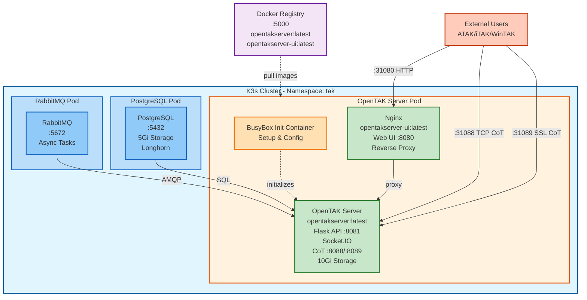

# Architecture

This document describes the deployment architecture and process for running OpenTAK Server on K3s with Arclink.

## Overview

Arclink deploys OpenTAK Server as a containerized application on Kubernetes (K3s), using custom Docker images with pre-installed dependencies for fast startup times. The deployment uses a local Docker registry for multi-node access and includes all necessary components for a complete TAK server.

## System Components



## Key Components

### K3s Kubernetes Distribution

Lightweight Kubernetes distribution optimized for:
- Resource-constrained environments
- Edge computing deployments
- ARM64 and AMD64 architectures
- Fast startup and low memory footprint

### OpenTAK Server

Open source TAK Server providing:
- CoT (Cursor on Target) message routing
- Data package management
- Video streaming support
- User and certificate management
- Mission planning and synchronization
- Flask API on port 8081
- Socket.IO for real-time updates

### PostgreSQL Database

- Persistent storage for all TAK data
- User accounts and authentication
- CoT message history
- Mission data
- 5Gi persistent volume (Longhorn)

### RabbitMQ Message Queue

- Async task processing
- NOT used for Socket.IO (runs in-process)
- Internal communication only

### Nginx Reverse Proxy

- Serves static UI files
- Proxies API requests to Flask
- Handles WebSocket upgrades for Socket.IO
- Cookie forwarding for session management

### Storage Layer

**Longhorn (Recommended for Production)**
- Distributed block storage
- Automatic replication
- Snapshot and backup capabilities
- High availability

**Local Path Provisioner (Development)**
- Simple local storage
- Fast performance
- No replication (single point of failure)

### Networking

- **NodePort Services**: Direct access without load balancer
- **Port Configuration**:
  - 31080: Web UI (HTTP)
  - 31088: TCP CoT
  - 31089: SSL CoT

## Deployment Process

### 1. Configuration (`configure.sh`)

Collects and validates deployment parameters:
- Primary node address (IP or DNS)
- Registry address
- NodePort assignments
- Namespace selection
- Credentials
- Auto-generates secure secrets (SECRET_KEY, SECURITY_PASSWORD_SALT)

Creates `config.env` with all settings and updates manifest files automatically.

### 2. Docker Registry Setup

Sets up local Docker registry for image distribution:
- Starts registry container on port 5000
- Configures K3s for insecure registry access
- Updates `/etc/rancher/k3s/registries.yaml`
- Restarts K3s services

**Why needed:** K3s nodes must pull images from local HTTP registry.

### 3. Image Building (`docker/setup.sh`)

Builds two custom images:

**OpenTAKServer Image:**
- Based on Python 3.13
- Installs OpenTAK Server from GitHub
- Applies Socket.IO patches for CORS and session compatibility
- Pre-installs all dependencies

**UI Image:**
- Node.js build stage
- Nginx runtime
- Serves pre-built static assets

**Build time:** ~30 minutes first time, cached afterwards.

### 4. Image Distribution

Pushes images to local registry:
```
localhost:5000/opentakserver:latest
localhost:5000/opentakserver-ui:latest
```

All cluster nodes can now pull these images.

### 5. Kubernetes Deployment (`deploy.sh`)

Deploys components in order:

1. **PostgreSQL** - Database with persistent storage
2. **RabbitMQ** - Message queue for async tasks
3. **Nginx Config** - ConfigMap with reverse proxy rules
4. **OpenTAK Server** - Main application with init container

**Pod startup time:** ~10 seconds with pre-built images.

### 6. Health Checks

Kubernetes probes ensure service health:
- **Readiness probe**: Checks `/api/health` before routing traffic
- **Liveness probe**: Monitors container health, restarts if failing

## Key Architecture Decisions

### Why Custom Images?

- **Fast startup:** 10 seconds vs 10-15 minutes with init containers
- **Reliability:** No network dependency during pod startup
- **Version control:** Pin specific OTS versions
- **Offline capability:** Can restart pods without internet

### Why Socket.IO Patches?

- **CORS fix:** Nginx reverse proxy requires CORS headers
- **Session compatibility:** RabbitMQ message_queue breaks Flask sessions
- **Performance:** In-process Socket.IO eliminates message queue overhead

### Why Static Secrets?

- **Session persistence:** Prevents logout on pod restarts
- **Multi-pod future:** Same secrets allow horizontal scaling
- **Security:** Generated randomly, stored securely in config.yml

### Why Local Registry?

- **Multi-node access:** All nodes can pull images
- **Fast deployment:** No external registry latency
- **Privacy:** Images stay on local network
- **Offline operation:** No internet required after initial setup

### Why ReadWriteOnce Volumes?

- **Database integrity:** PostgreSQL requires exclusive access
- **Longhorn support:** Default storage class on K3s
- **Single replica:** Current deployment doesn't need horizontal scaling

## Data Flow

### User Login Flow

```
Browser → Nginx:8080/api/login
  → Flask:8081/api/login
    → PostgreSQL:5432 (verify credentials)
    → Flask-Security (create session)
  ← Set-Cookie: session=...
← 200 OK
```

### Socket.IO Connection Flow

```
Browser → Nginx:8080/socket.io/?EIO=4&transport=polling
  (Cookie: session=... forwarded by nginx)
  → Flask:8081/socket.io/?EIO=4&transport=polling
    → Flask-SocketIO (verify session)
    → Upgrade to WebSocket
  ← Socket.IO connection established
← Real-time map updates flow
```

### CoT Data Flow

```
TAK Client → K3s NodePort:31088 (TCP CoT)
  → OpenTAKServer:8088
    → PostgreSQL:5432 (store CoT)
    → Socket.IO broadcast
      → All connected web clients (real-time updates)
```

## Performance Characteristics

- **Pod startup time:** ~10 seconds (with pre-built images)
- **Page load time:** &lt; 2 seconds (optimized Socket.IO)
- **Socket.IO latency:** &lt; 100ms (in-process, no message queue)
- **Database queries:** 60-70ms average (Flask API)
- **Image build time:** ~30 minutes first time (cached afterwards)

## Resource Requirements

### Minimum (Single Node)

- **CPU**: 2 cores
- **RAM**: 4GB
- **Storage**: 20GB
- **Network**: 100Mbps

### Recommended (Production)

- **CPU**: 4+ cores
- **RAM**: 8GB+
- **Storage**: 100GB+ (with Longhorn)
- **Network**: 1Gbps

### Raspberry Pi 5

- Works with 4GB or 8GB models
- NVMe SSD strongly recommended
- Cluster of 3+ nodes for HA

## Security Considerations

### Current Security

- ✅ Static secrets prevent session hijacking
- ✅ Flask-Security authentication enforced
- ✅ PostgreSQL credentials configurable
- ✅ Session cookies with HttpOnly flag
- ✅ CSRF protection enabled

### Production Recommendations

- ⚠️ Change default passwords (administrator, PostgreSQL, RabbitMQ)
- ⚠️ Use Kubernetes secrets instead of plaintext in manifests
- ⚠️ Enable HTTPS with TLS certificates
- ⚠️ Restrict CORS to specific domains (currently wildcard)
- ⚠️ Use ingress controller instead of NodePort for production
- ⚠️ Enable PostgreSQL SSL connections
- ⚠️ Implement network policies for pod isolation

## Deployment Model

### Portable Configuration

All configuration is stored in `config.env`, making deployments reproducible across:
- Development laptops
- Production servers
- Edge devices (Raspberry Pi, NUC, etc.)
- Mobile command centers

### High Availability (Planned)

Future enhancements:
- Multi-node K3s clusters with failover
- Load balancing with MetalLB
- Database replication
- Automatic failover
- Horizontal pod autoscaling
